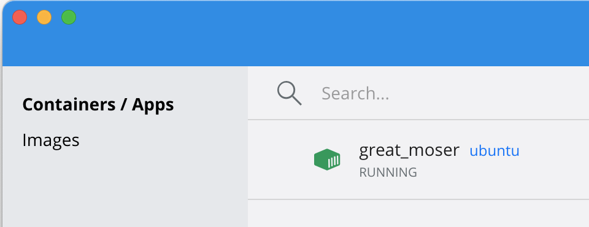

# Introduction to containers

## Learning outcomes

**After having completed this chapter you will be able to:**

* Discriminate between an image and a container
* Run a Docker container from Docker Hub interactively
* Validate the available containers and their status

## Material

**General introduction:**

[:fontawesome-solid-file-pdf: Download the presentation](../assets/pdf/general_introduction.pdf){: .md-button }

**Introduction to containers:**

[:fontawesome-solid-file-pdf: Download the presentation](../assets/pdf/introduction_containers.pdf){: .md-button }

<iframe width="560" height="315" src="https://www.youtube.com/embed/Qfh80DlF1_4" title="YouTube video player" frameborder="0" allow="accelerometer; autoplay; clipboard-write; encrypted-media; gyroscope; picture-in-picture" allowfullscreen></iframe>

## Exercises

We recommend using a code editor like VS Code or Sublime text. If you don't know which one to chose, take VS Code as we can provide most support for this editor. If you haven't set up your working environment yet, you can find instructions [here](../precourse.md#software).

!!! note "Work in projects"
    We recommend to work in a project folder. This will make it easier to find your files and to share them with others. You can create a project folder anywhere on your computer. For example, you can create a folder `projects` in your home directory and then create a subfolder `container-course` in it. You can then open this folder in VS Code.

Let's create our first container from an existing image. We do this with the image `ubuntu`, generating an environment with a minimal installation of ubuntu.  

```sh
docker run -it ubuntu
```

This will give you an interactive shell into the created container (this interactivity was invoked by the options `-i` and `-t`) .

**Exercise:** Check out the operating system of the container by typing `cat /etc/os-release` in the container's shell. Are we really in an ubuntu environment?

??? success "Answer"
    Yes:

    ```
    root@33bd068de5e2:/# cat /etc/os-release
    PRETTY_NAME="Ubuntu 24.04 LTS"
    NAME="Ubuntu"
    VERSION_ID="24.04"
    VERSION="24.04 LTS (Noble Numbat)"
    VERSION_CODENAME=noble
    ID=ubuntu
    ID_LIKE=debian
    HOME_URL="https://www.ubuntu.com/"
    SUPPORT_URL="https://help.ubuntu.com/"
    BUG_REPORT_URL="https://bugs.launchpad.net/ubuntu/"
    PRIVACY_POLICY_URL="https://www.ubuntu.com/legal/terms-and-policies/privacy-policy"
    UBUNTU_CODENAME=noble
    LOGO=ubuntu-logo
    ```

!!! note "Where does the image come from?"
    If the image `ubuntu` was not on your computer yet, `docker` will search and try to get them from [Docker Hub](https://hub.docker.com/), and download it.

**Exercise:** Run the command `whoami` in the Docker container. Who are you?

??? success "Answer"
    The command `whoami` returns the current user. In the container `whoami` will return `root`. This means you are the [`root` user](https://en.wikipedia.org/wiki/Superuser) i.e. within the container you are admin and can basically change anything.  

Check out the container panel at the Docker dashboard (the Docker gui) or open another host terminal and type:

```
docker container ls -a
```

**Exercise:** What is the container status?

??? success "Answer"
    In Docker dashboard you can see that the shell is running:

    <figure>
      
    </figure>

    The output of `docker container ls -a` is:

    ```
    CONTAINER ID   IMAGE     COMMAND       CREATED         STATUS         PORTS     NAMES
    27f7d11608de   ubuntu    "/bin/bash"   7 minutes ago   Up 6 minutes             great_moser
    ```

    Also showing you that the `STATUS` is `Up`.

Now let's install some software in our `ubuntu` environment. We'll install some simple software called [`figlet`](http://www.figlet.org/). Type into the container shell:

```sh
apt-get update
apt-get install figlet
```

!!! note "This will give some warnings"
    This installation will give some warnings. It's safe to ignore them.

Now let's try it out. Type into the container shell:

```sh
figlet 'SIB courses are great!'
```

Now you have installed and used software `figlet` in an `ubuntu` environment (almost) completely separated from your host computer. This already gives you an idea of the power of containerization.

Exit the shell by typing `exit`. Check out the container panel of Docker dashboard or type:

```sh
docker container ls -a
```

**Exercise:** What is the container status?

??? success "Answer"
    `docker container ls -a` gives:

    ```
    CONTAINER ID   IMAGE     COMMAND       CREATED          STATUS                     PORTS     NAMES
    27f7d11608de   ubuntu    "/bin/bash"   15 minutes ago   Exited (0) 8 seconds ago             great_moser
    ```

    Showing that the container has exited, meaning it's not running.
